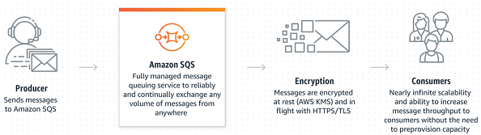
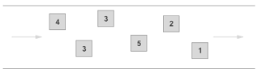

---
runme:
  id: 01HHNWJWQBXBY7702ND516KST3
  version: v2.0
---

# Concepts

## Amazon Simple Queue Service (SQS)

Fully managed message queuing for microservices, distributed systems, and
serverless applications.

- Eliminate overhead with no upfront costs and without needing to manage
   software or maintain infrastructure.
- Reliably deliver large volumes of data, at any level of throughput, without
   losing messages or needing other services to be available.
- Securely send sensitive data between applications and centrally manage your
   keys using AWS Key Management.
- Scale elastically and cost-effectively based on usage so you don’t have to
   worry about capacity planning and preprovisioning.

## How it works

Amazon Simple Queue Service (Amazon SQS) lets you send, store, and receive
messages between software components at any volume, without losing messages or
requiring other services to be available.

## Use cases

- **Increase application reliability and scale:** Amazon SQS provides a simple
   and reliable way for customers to decouple and connect components
   (microservices) together using queues.
- **Decouple microservices and process event-driven applications:** Separate
   frontend from backend systems, such as in a banking application. Customers
   immediately get a response, but the bill payments are processed in the
   background.
- **Ensure work is completed cost-effectively and on time:** Place work in a
   single queue where multiple workers in an autoscale group scale up and down
   based on workload and latency requirements.
- **Maintain message ordering with deduplication:** Process messages at high
   scale while maintaining the message order, allowing you to deduplicate messages.

## Autoscaling with SQL - How it works ?

- **Scaling Up and Down:**

   - The autoscaling group will manage a group of worker instances or processes.
   - Scaling up occurs when the number of tasks in the SQS queue increases, and
      additional worker instances are needed to handle the workload.
   - Scaling down happens when the workload decreases, and surplus worker
      instances are terminated to save costs.

- **Based on Workload and Latency Requirements:**

   - The decision to scale up or down is driven by workload and latency
      requirements.
   - Workload: The number of tasks in the SQS queue. When the queue depth
      increases, indicating higher demand, the autoscaling group may scale up.
   - Latency Requirements: This could refer to the time sensitivity of processing
      tasks. If low latency is crucial, scaling up might occur to handle tasks more
      quickly.

Practical Workflow:

- A task is submitted to the SQS queue.
- The autoscaling group monitors the SQS queue for changes in workload.
- If the workload increases (more tasks in the queue), the autoscaling group may
   automatically launch additional worker instances to handle the load.
- Conversely, if the workload decreases, surplus worker instances may be
   terminated to save costs.

By combining SQS with autoscaling, you create a flexible and scalable system
that can adapt to varying workloads efficiently, ensuring that work is completed
both cost-effectively and on time. This setup is particularly useful in dynamic
and variable workloads commonly found in cloud-based applications.

## Queue types

Amazon SQS offers two queue types for different application requirements:

**Standard Queues**

- **Unlimited Throughput:** Standard queues support a nearly unlimited number
   of transactions per second (TPS) per API action.
- **At-Least-Once Delivery:** A message is delivered at least once, but
   occasionally more than one copy of a message is delivered.
- **Best-Effort Ordering:** Occasionally, messages might be delivered in an
   order different from which they were sent.
- 
- You can use standard message queues in many scenarios, as long as your
   application can process messages that arrive more than once and out of order,
   for example:

   - Decouple live user requests from intensive background work: Let users upload
      media while resizing or encoding it.
   - Allocate tasks to multiple worker nodes: Process a high number of credit
      card validation requests.
   - Batch messages for future processing: Schedule multiple entries to be added
      to a database.

**FIFO Queues**

- **High Throughput:** By default, FIFO queues support up to 3,000 messages per
   second with batching or up to 300 messages per second (300 send, receive, or
   delete operations per second) without batching. If you require higher
   throughput, you can enable high throughput mode for FIFO on the Amazon SQS
   console, which will support up to 70,000 messages per second without batching
   and even higher with batching. For a detailed breakdown of FIFO high throughput
   mode quotas per region, please see [AWS Documentation](https://docs.aws.amazon.com/AWSSimpleQueueService/latest/SQSDeveloperGuide/quotas-messages.html).
- **Exactly-Once Processing:** A message is delivered once and remains available
   until a consumer processes and deletes it. Duplicates aren't introduced into the
   queue.
- **First-In-First-Out Delivery:** The order in which messages are sent and
   received is strictly preserved (i.e. First-In-First-Out).
- 
- FIFO queues are designed to enhance messaging between applications when the
   order of operations and events is critical, or where duplicates can't be
   tolerated, for example:

   - Ensure that user-entered commands are executed in the right order.
   - Display the correct product price by sending price modifications in the
      right order.
   - Prevent a student from enrolling in a course before registering for an
      account.

## Queue Functionality

- **Unlimited queues and messages:** Create unlimited Amazon SQS queues with an
   unlimited number of messages in any Region.
- **Payload Size:** Message payloads can contain up to 256KB of text in any
   format. Each 64KB ‘chunk’ of payload is billed as 1 request. For example, a
   single API call with a 256KB payload will be billed as four requests. To send
   messages larger than 256KB, you can use the [Amazon SQS Extended Client Library
   for Java](https://github.com/awslabs/amazon-sqs-java-extended-client-lib), which
   uses Amazon Simple Storage Service (S3) to store the message payload.
   A reference to the message payload is sent using SQS.
- **Batches:** Send, receive, or delete messages in batches of up to 10 messages
   or 256KB. Batches cost the same amount as single messages, meaning SQS can be
   even more cost effective for customers that use batching.
- [Long polling](http://docs.aws.amazon.com/AWSSimpleQueueService/latest/SQSDeveloperGuide/sqs-long-polling.html):
   Reduce extraneous polling to minimize cost while receiving new messages as
   quickly as possible. When your queue is empty, long-poll requests wait up to 20
   seconds for the next message to arrive. Long poll requests cost the same amount
   as regular requests.
- **Retain messages in queues for up to 14 days.**
- **Send and read messages simultaneously.**
- **Message locking:** When a message is received, it becomes “locked” while
   being processed. This keeps other computers from processing the message
   simultaneously. If the message processing fails, the lock will expire and the
   message will be available again.
- **Queue sharing:** Securely share Amazon SQS queues anonymously or with
   specific AWS accounts. Queue sharing can also be restricted by IP address and
   time-of-day.
- **Server-side encryption (SSE):** Protect the contents of messages in Amazon
   SQS queues using keys managed in the AWS Key Management Service (AWS KMS). SSE
   encrypts messages as soon as Amazon SQS receives them. The messages are stored
   in encrypted form and Amazon SQS decrypts messages only when they are sent to an
   authorized consumer.
- **Dead Letter Queues (DLQ):** Handle messages that a consumer has not
   successfully processed with dead- letter queues (DLQs). When a message's maximum
   receive count is exceeded, Amazon SQS moves the message to the DLQ associated
   with the original queue. DLQs must be of the same type as the source queue
   (standard or FIFO). You can inspect the messages in DLQs to understand why your
   consumer has not successfully received them. Once you have remediated the
   issues, you can move the messages from the DLQ to their respective source
   queues.

## Application Considerations

1. **Visibility Timeout:**

- Sets the length of time that a message received from a queue (by one
   consumer) will not be visible to the other message consumers.
- The visibility timeout begins when Amazon SQS returns a message. If the
   consumer fails to process and delete the message before the visibility timeout
   expires, the message becomes visible to other consumers. If a message must be
   received only once, your consumer must delete it within the duration of the
   visibility timeout.
- The default visibility timeout setting is 30 seconds. This setting applies
   to all messages in the queue. Typically, you should set the visibility timeout
   to the maximum time that it takes your application to process and delete a
   message from the queue.
- For optimal performance, set the visibility timeout to be larger than the
   AWS SDK read timeout. This applies to using the ReceiveMessage API action with
   either short polling or long polling.

2. **Delivery delay:**

- If your consumers need additional time to process messages, you can delay
   each new message coming to the queue. The delivery delay is the amount of time
   to delay the first delivery of each message added to the queue. Any messages
   that you send to the queue remain invisible to consumers for the duration of
   the delay period. The default (minimum) delay for a queue is 0 seconds. The
   maximum is 15 minutes.
- For standard queues, the per-queue delay setting is not retroactive;
   changing the setting doesn't affect the delay of messages already in the
   queue.
- For FIFO queues, the per-queue delay setting is retroactive; changing the
   setting affects the delay of messages already in the queue.

3. **Receive message wait time:**

- The receive message wait time is the maximum amount of time that polling
   will wait for messages to become available to receive. The minimum value is
   zero seconds and the maximum value is 20 seconds.
- Long polling helps reduce the cost of using Amazon SQS by eliminating the
   number of empty responses (when there are no messages available for a
   ReceiveMessage request) and false empty responses (when messages are available
   but aren't included in a response). If a receive request collects the maximum
   number of messages, it returns immediately. It does not wait for the polling
   to time out.
- If you set the receive message wait time to zero, the receive requests use
   short polling.

4. **Redrive allow policy:**

- The redrive allow policy defines which source queues can use this queue as
   the dead-letter queue.
- By default, the redrive allow policy is disabled, which results in the same
   behavior as allowing all source queues to use this queue as the dead-letter
   queue.
- When enabling the redrive allow policy, you can choose to allow or deny all
   source queues or specify a list of up to 10 source queues by ARN.
- The source queues must be owned by the same AWS account and must reside in
   the same region as the dead-letter queue.

5. **Dead-letter queues:**

- If a message can't be consumed successfully, you can send it to a
   dead-letter queue (DLQ). Dead-letter queues let you isolate problematic
   messages to determine why they are failing.
- When you designate a queue to be a source queue, a DLQ is not created
   automatically. You must first create a queue to designate as the DLQ. The DLQ
   queue type (standard or FIFO) must match the source queues. You can associate
   the same DLQ with more than one source queue.
- The **Maximum receives** value determines when a message will be sent to the
   DLQ. If the **ReceiveCount** for a message exceeds the maximum receive count
   for the queue, Amazon SQS moves the message to the associated DLQ (with its
   original message ID).
- You must use the same AWS account to create the DLQ and the source queues
   that send messages to the DLQ. Also, the DLQ must reside in the same region as
   the source queues that use the DLQ.

6. **Retrieving Messages:**

- When you request a message from a queue, you don't specify request a
   specific message. Instead, you specify the maximum number of messages
   (up to 10) that you want to retrieve.
- Fetch the number of messages that you want to process concurrently at a
   time.

7. **Batching:**

- Try to always batch requests.

8. **Large Message Size:**

- Use s3 bucket to store message, and save a pointer to it in the message.

9. **Message Retry Time**:

- Setup a dead-letter queue.
- Set the appropriate message retry count.

## Implementation Help

- [use s3 with sqs](https://github.com/awslabs/amazon-sqs-java-extended-client-lib)

## Nodejs Concurrency Problems

- [linux connections](https://stackoverflow.com/questions/410616/increasing-the-maximum-number-of-tcp-ip-connections-in-linux)
- [max out](https://stackoverflow.com/questions/17033631/node-js-maxing-out-at-1000-concurrent-connections)
- [benchmark](https://www.reddit.com/r/node/comments/13oqbvi/i_have_done_a_full_benchmark_of_a_post_rest_api/)
- [quora post](https://www.quora.com/How-do-you-handle-millions-of-request-in-Node-js)
- [quora post 2](https://www.quora.com/Is-a-Node-js-server-good-enough-to-handle-1-million-concurrent-requests)
- [quora post 3](https://www.quora.com/What-are-the-benefits-of-using-Node-js-for-high-traffic-websites-How-many-requests-per-second-can-a-Node-js-application-handle-approximately)
- [express test](https://plainenglish.io/blog/how-many-requests-can-handle-a-real-world-nodejs-server-side-application)
- [uwebsocketjs cluster](https://github.com/uNetworking/uWebSockets.js/issues/593)
- [uwebsocketjs example](https://github.com/uNetworking/uWebSockets.js/blob/master/examples/WorkerThreads.js)
- [million websockets](https://unetworkingab.medium.com/millions-of-active-websockets-with-node-js-7dc575746a01)
- [useful dude](https://www.linkedin.com/in/kartikk2/)
- [cache package](https://github.com/kartikk221/cached-lookup)
- [hyper-express](https://github.com/kartikk221/hyper-express)
- [framework benchmarks](https://web-frameworks-benchmark.netlify.app/result?l=javascript)
- [raw uwebsocketsjs](https://dev.to/mattkrick/replacing-express-with-uwebsockets-48ph)
- [real world example](https://stackoverflow.com/questions/68869770/ingesting-millions-of-telemetry-events-per-day-redis-vs-kafka-vs-another-queue?rq=2)

## Notifications with Graph API

- [setup](https://www.tines.com/blog/updated-microsoft-graph-security-automation)
- [working](https://www.tines.com/blog/subscribing-to-notifications-in-ms-graph)
- [accepting delivery](https://learn.microsoft.com/en-us/graph/change-notifications-delivery-webhooks?tabs=http)
- [eventhubs](https://learn.microsoft.com/en-us/graph/change-notifications-delivery-event-hubs?tabs=change-notifications-eventhubs-azure-portal%2Chttp)
- [webhook sample](https://github.com/microsoftgraph/nodejs-webhooks-sample)
- [Throttling](https://learn.microsoft.com/en-us/graph/throttling)
- [Throttling 2](https://learn.microsoft.com/en-us/answers/questions/542802/what-are-the-limits-to-use-microsoft-graph-api-to)
- [Throttling Pattern](https://learn.microsoft.com/en-us/azure/architecture/patterns/throttling)
- [Throttling Limits](https://learn.microsoft.com/en-us/graph/throttling-limits)

## Webhooks vs Azure Event Hubs

Webhooks may not be suitable for receiving change notifications in high
throughput scenarios or when the receiver can't expose a publicly available
notification URL. As an alternative, you can use Azure Event Hubs.

Good examples of high throughput scenarios include applications subscribing to a
large set of resources, applications subscribing to resources that change with a
high frequency, and multitenant applications that subscribe to resources across
a large set of organizations.

The article guides you through the process of managing your Microsoft Graph
subscription and how to receive change notifications through Azure Event Hubs.

## Using Azure Event Hubs to receive change notification

Azure Event Hubs is a popular real-time events ingestion and distribution
service built for scale. You can use Azure Events Hubs instead of traditional
webhooks to receive change notifications. Using Azure Event Hubs to receive
change notifications differs from webhooks in a few ways, including:

- You don't rely on publicly exposed notification URLs. The Event Hubs SDK
   relays the notifications to your application.
- You don't need to reply to the notification URL validation. You can ignore the
   validation message that you receive.
- You need to provision an Azure Event Hub.
- You need to provision an Azure Key Vault.

## Azure Event Hubs Receive notifications

- [process](https://learn.microsoft.com/en-us/azure/event-hubs/event-hubs-node-get-started-send?tabs=passwordless%2Croles-azure-portal)
- [lifecycle notifications](https://learn.microsoft.com/en-us/graph/webhooks-lifecycle?tabs=http)

## Azure Messaging

- [comprehensive guide](https://medium.com/@JeffyJeff/a-comprehensive-guide-to-azure-message-based-and-event-based-solutions-50e9eb2f6a60)